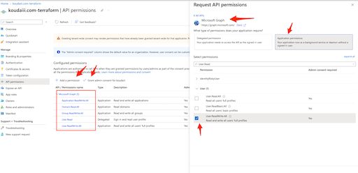
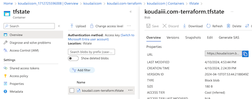

# koudaiii.com-terraform

## Require

- GitHub Account
- subscription_id
- setup terraform [Install tfenv](https://github.com/tfutils/tfenv)
- [Install tflint](https://github.com/terraform-linters/tflint)
- [Install TFLint Ruleset for terraform-provider-azurerm](https://github.com/terraform-linters/tflint-ruleset-azurerm)
- [Install tfcmt](https://suzuki-shunsuke.github.io/tfcmt/)

## 1. Authenticating using a Service Principal and OpenID Connect

https://registry.terraform.io/providers/hashicorp/azuread/latest/docs/guides/service_principal_oidc

### Go Microsoft Entra ID


### Creating the Application and Service Principal

https://registry.terraform.io/providers/hashicorp/azuread/latest/docs/guides/service_principal_oidc#creating-the-application-and-service-principal

- Add an App registrations


- Register an application


### Configure Azure Active Directory Application to Trust a GitHub Repository

https://registry.terraform.io/providers/hashicorp/azuread/latest/docs/guides/service_principal_oidc#configure-azure-active-directory-application-to-trust-a-github-repository

- Go Certificates and secrets


- Add Federated credential


- Edit a credential


### Configuring Terraform to use OIDC

https://registry.terraform.io/providers/hashicorp/azuread/latest/docs/guides/service_principal_oidc#configuring-terraform-to-use-oidc

```console
$ export ARM_CLIENT_ID="00000000-0000-0000-0000-000000000000"
$ export ARM_SUBSCRIPTION_ID="00000000-0000-0000-0000-000000000000"
$ export ARM_TENANT_ID="00000000-0000-0000-0000-000000000000"
$ terraform plan
```

And setup GitHub Actions workflows


## 2. Configuring a User or Service Principal for managing Azure Active Directory

https://registry.terraform.io/providers/hashicorp/azuread/latest/docs/guides/service_principal_configuration



## 3. Setup tfstate in blob strage

[Store Terraform state in Azure Storage](https://learn.microsoft.com/azure/developer/terraform/store-state-in-azure-storage?tabs=azure-cli)

```console
# setup subscription_id in scripts/*
$ scripts/create-tfstate
$ scripts/get-account-key
```


